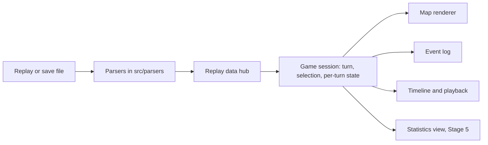
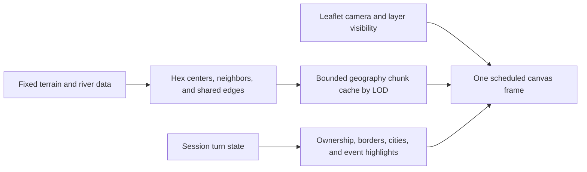

# Frontend redesign plan

Status: draft for revision. This document keeps the stages, mockups, and open decisions in one place. Implementation happens one stage at a time, and each stage ends with a review of the replay and save examples on desktop and phone before the next one starts.

## Overall direction

Make the map the center of the experience, with a clear timeline, useful inspection, and a separate space for statistics. Keep some Civilization character through restrained colors and typography, while giving controls and content room to breathe.

The current viewer combines a map, playback controls, and an event log. It opens replay and save files and already reads 29 statistics datasets per civilization. Save files also carry river edges, which Stage 4 now draws. Everything richer (plot ownership from the save, city details, economy, diplomacy) needs parser work first, and part of that work is finding out whether the save holds any history for it or only the final snapshot.

The application has three destinations: **Map**, **Events**, and **Statistics**. On larger screens, events and inspection sit beside the map. On phones, each destination gets the full content area, and map details open in a bottom sheet. Changing destinations preserves the selected turn and civilization.

### Two kinds of data

- **Replay history** is known at every turn: the event log and the datasets, which both file types carry, plus terrain and rivers. Terrain and rivers are fixed when the map is generated, so they are valid at every turn even though only save files store the rivers.
- **Saved snapshot** is known only at the turn of the loaded save: plot ownership, improvements, resources, routes, city details, and anything else read from the save's game state. Stage 3 settled the open question: nothing in the save's game state carries per-turn history. The datasets remain the only per-turn numeric series, and everything else the save adds is either a snapshot or a map fact fixed at generation.

Snapshot details appear only while the timeline sits on the save's last turn and step aside with a short note when it moves back. This keeps a single timeline and needs no separate mode. A replay file never has snapshot data and stays fully useful without it. When the save is a finished game, the snapshot is the end-game position. When it is not, the interface says "Snapshot at turn ..." and never implies that the game ended.

### Technology decisions

- **Plain TypeScript and plain CSS, no framework.** jQuery, Bootstrap 3, bootstrap-slider, and selectpicker leave in Stage 2 together with the layout they hold up.
- **Stage 4 replaces the canvas tile renderer.** The implementation keeps Leaflet for navigation and uses one viewport canvas with cached geography. Desktop browser profiling compares it with the original renderer; physical phone validation remains open.
- **Vitest covers core logic**, meaning the session model, parsers, and statistics selectors. The UI is reviewed by hand on the examples. Each stage lists its minimal coverage.
- **Shared links carry more state.** The `file` and `turn` parameters grow to include the destination, and the chosen measure, so a link lands where the sender was looking.

## Stage 1: Refactor the core into a session model

Status: implemented. The session model lives in `src/replay/session.ts`, the compact ownership timeline in `src/replay/ownership.ts`, and the map, the event log, and the timeline all follow the session through subscriptions. Turn-state folding no longer happens in the renderer, and the datasets are typed as one series of turn and value pairs per civilization.

**Goal:** give Stage 2 a clean baseline. The UI stays as it is.

Today the turn-by-turn ownership of tiles is computed inside the map class in `src/map/replay-map.ts`, which also keeps a full copy of the tile state for every turn. That logic moves into a core session model that owns the loaded game, the current turn, the selection (civilization, tile, or city), and the per-turn state derived from events. The map, event log, and timeline become subscribers of the session instead of calling each other.



Work in this stage:

- Move per-turn ownership out of the renderer and store it compactly, as a list of ownership changes per tile rather than a full copy of the map per turn. Large maps on phones depend on this.
- Give every piece of data a kind, history or snapshot, at the Replay level so later views never guess.
- Fix the datasets typing in `src/replay/replay.ts`: the stored shape is one series of turn and value pairs per civilization for each dataset, and the declared type says something else.
- Keep file opening, drag and drop, shared links, starting turn links, playback shortcuts, event filters, and event-to-map interactions working. The viewer, the Replay hub, the parsers, the event and strategy parsers, the text formatter, and the civilization colors stay.

**Tests:** per-turn ownership from the session model checked against the example replays for a founded city, a tile claim, a city transfer, and a razing. The existing parser tests keep passing.

**Ready to move on when:** the examples still work and the map, events, and timeline are driven by the session rather than by each other.

## Stage 2: Build a responsive layout in plain CSS

Status: implemented. The layout now runs on plain CSS with a compact header, a one-row timeline built on a native range input, an events side panel beside the map, and destination tabs below a 900px width. jQuery, Bootstrap 3, bootstrap-slider, and selectpicker are gone. Every button-like control carries a Font Awesome icon, matching the icon font the event text already uses. A shared link can also annotate civilizations with `player0` through `playerN` parameters, which show up in the header and next to civilization names in the log; see the README section "Annotating Civilizations". Two decisions settled during implementation: the statistics destination stays hidden until Stage 5 delivers content for it, so the tabs are Map and Events for now, and the bundled example buttons load the save whenever one exists because it carries everything the replay carries plus the rivers. The styling keeps the Civilization palette (parchment, gold, deep teal) in CSS only, without the ornate border images, and the address bar follows the current turn and destination so a copied link lands where the sender was looking.

**Goal:** make opening and exploring a game comfortable on desktop, tablet, and phone.

Rebuild `index.html` and `assets/main.css` around a compact header, a persistent one-row timeline, and an events side panel beside the map on larger screens. On phones, the three destinations become tabs that take the full content area, and map details open in a bottom sheet. Use native controls where they fit (a range input for the timeline, a details element for filters) and small custom ones where they do not. Add an obvious Open file action, a welcoming empty state, and visible loading and error feedback in place of the current alert dialogs.

Desktop layout:

```text
+-----------------------------------------------------------------------------+
| Vox Deorum Replay    Claude-5-Opus · Standard · Small           [Open] [Stats] |
+-----------------------------------------------------+-----------------------+
| [Layers v]                                          | Events     [7 types v]|
|                                                     |-----------------------|
|                                                     |                       |
|                        MAP                          | T180  Rome founded    |
|                                                     |       Antium          |
|                                                     | T180  Egypt claimed   |
|                                                     |       3 tiles         |
|                                                     | T179  Rome adopted    |
|                                            [+] [-]  |       Tradition       |
+-----------------------------------------------------+-----------------------+
| [|<] [<] [ Play ] [>]   o============o-----------------  Turn 180 / 320  1x |
+-----------------------------------------------------------------------------+
```

Phone layout, portrait:

```text
+-------------------------------+
| Vox Deorum Replay      [Open] |
| [ Map ] [Events] [Statistics] |
+-------------------------------+
| [Layers]                      |
|                               |
|                               |
|              MAP              |
|                               |
|                               |
|                        [+][-] |
+-------------------------------+
| [<] [Play] [>]  o====o--- 180 |
+-------------------------------+
```

The play button switches between Play and Pause. Tapping the turn number opens a small popover with a go-to field and the speed choice, so the timeline stays one row. On phones, the destination tabs give Map, Events, and Statistics the full content area. On larger screens, Events stays in the side panel beside the map, and the Statistics button in the header opens the statistics view in place of the map. On tablets and in landscape, the side panel shows only while enough map space remains. Resizing preserves the place the user is exploring.

Empty state, shown before a file is loaded and reachable again from Open file:

```text
+------------------------------------------------+
|               Vox Deorum Replay                |
|                                                |
|                [Open file icon]                |
|      Drop a .Civ5Replay or .Civ5Save here      |
|                                                |
|  --------------------------------------------  |
|  [Claude-5-Opus] [GLM-5.2] [GPT-5.6-Sol]        |
|  [Qwen-3.8-27B]                                 |
|                                                |
+------------------------------------------------+
```

The examples are bundled playthroughs named after their files: each was driven by the model it is named after, and opening one marks its civilizations with decision-making trails through the `model` parameter. Show a loading indicator while we process the save, including from the URL.

Support touch panning and zooming, large tap targets, keyboard navigation, visible focus, and labels that do not rely on color alone. Essential information is available by tap or selection rather than hover.

**Tests:** the bundle builds and the existing suite passes. Layout is reviewed by hand at phone, tablet, and desktop widths.

**Ready to move on when:** a user can open a file, navigate turns, filter events, and inspect the map on a narrow phone screen without page-wide horizontal scrolling.

**Decision to revisit:** the amount of Civilization ornamentation. The proposed default is a quiet, modern frame around a visually rich map.

## Stage 3: Explore and expand the parsers

Status: implemented. The save parser reads the full map header, and the example maps wrap horizontally, which Stage 4 needs for wrapped panning. Plot records now carry the snapshot fields (owner, resource, improvement, route, city flag, owning city pair), and the validation was stronger than hoped: on both example saves, every plot the save calls owned agrees with the event-derived ownership owner by owner, the owned plot count matches the header, and the city flags land exactly on the founded-and-not-razed cities. The event processor preserves ownership releases, which arrive as claims without a known civilization. The ownership fold clears the owner while keeping a city until its razing event. Both example saves agree with the fold on every plot, including the five released tiles around Rapa Nui and the fifteen around Belo Horizonte. The victory block is read from the game prelude and a result counts as reliable only when the event log confirms it with a victory message at the winning turn, so the finished example reports a reliable cultural win at turn 484 while the mid game save reports no result. Because some saves are taken one turn before the game is won and can never prove their result, a `winner` address bar parameter can assert it externally: it names the civilization by number or by a `playerN` label, applies only when the file has no proven result of its own, and the header shows it as coming from the link. Per civilization dataset diagnostics (attached, damaged entries) now flow through the Replay hub so statistics can label uncertain series. The per player sections were surveyed in the game DLL source: city records, diplomacy, and everything else there hold current values and single turn stamps only, so no per-player field earns the decode effort for now. The findings are recorded in `docs/save-format.md`, and the data inventory below lets Stages 4 to 6 name their layers and measures from it.

**Goal:** know what the files can tell us before designing map layers and statistics around guesses.

The save parser in `src/parsers/save-parser.ts` currently stops reading each plot record after terrain, feature, and river ids, even though `docs/save-format.md` documents where owner, improvement, resource, and route sit. The map header's wrap flags and the game prelude's winning turn are read and discarded. The per-player sections holding cities, units, and diplomacy are not read at all. Datasets from saves are attributed to civilizations by heuristics whose diagnostics never reach the interface.

Work in this stage:

- Expose the map wrap flags and the remaining map header fields.
- Read plot owner, improvement, resource, route, and any other cheap per-plot field. Compare the plot owner with the event-derived ownership at the save turn; agreement validates both.
- Expose the winning turn and the victory information from the header, and define what counts as a reliable result.
- Survey the per-player sections: what a city record carries (population, buildings, founding turn), what the diplomacy block holds, and which fields, if any, are per-turn history rather than current values. Record the findings in `docs/save-format.md`.
- Surface the save dataset diagnostics (damaged and unattached clusters) so statistics can label uncertain series.
- Produce a data inventory: every field of interest marked history, snapshot, or unavailable, with the parser cost of reading it.

**Tests:** new fields are checked against replay ground truth where one exists (plot owner against events at the final turn) and against invariants where none does (river edge pairing, city count against founded and razed events).

**Ready to move on when:** the data inventory is written and Stages 4 to 6 can name their layers and measures from it.

**Decision to revisit:** which per-player fields earn the decode effort. A field with history is worth more than a richer snapshot.

## Stage 4: Improve the 2D map renderer and add rivers

Status: the viewport renderer, cached geography, zoom detail, rivers, ownership releases, and layer controls are implemented, and the application draws the approved painted textures in `assets/tiles/`, including simple single-landform relief, smaller wetlands and oases, subtle flood plains, and an aquatic blue-green coast. Physical phone performance and touch navigation still need validation, and optional wrapped panning remains open.

**Goal:** smooth exploration and playback, with geography and territory readable at world scale and painted detail revealed as the user zooms in.

### Baseline and performance targets

The original renderer created nine Leaflet canvas tile layers, including selection and events. Each turn redrew territory, cities, grid, boundaries, and event highlights through separate visible-hex loops. Boundary drawing created neighbor maps and edge sets for each hex, and terrain drawing looked up images in the DOM. Terrain itself was already static between turns.

Profile the existing renderer before implementation. Identify the largest example by plot count, then compare the same file, turns, viewport, and device with the replacement. Record pan and pinch frame times, playback and timeline scrub latency, draw time separately from session and event-list work, live canvas count, and estimated canvas and decoded-image bytes. Capture a cold load and a warm run. Review desktop and an actual phone, recording device, browser, viewport, and pixel ratio; desktop phone emulation alone cannot establish phone performance.

Provisional targets are a 95th-percentile frame time below 16.7 ms on desktop and 33 ms on the test phone during continuous interaction, with the latest scrubbed turn visible within 100 ms after input settles. Aim for a renderer-owned working set below 64 MiB on the phone. These are acceptance targets, not current results; keep parser and event-list memory separate and record whole-page memory where the browser supports it.

### Renderer design

`src/map/replay-map.ts` keeps Leaflet for navigation, zoom controls, and resize behavior. `src/map/viewport-layer.ts` draws the map into one viewport canvas using the shared flat hex coordinates in `src/map/hex-geometry.ts`. Fit bounds, event positions, and selection use those coordinates too. `src/map/renderer-support.ts` coalesces animation-frame requests and maintains a 32 MiB raster cache. Static geography uses 12 by 12 tile chunks, quantized raster scales, and a soft 4 ms cache-building budget per frame.

The viewport canvas composites cached geography and current overlays. It is sized to the visible container rather than to the entire map at maximum zoom. Cap the backing pixel ratio at 2 initially and include the backing store in the memory budget.

Zoom buttons use half-level steps and wheel zoom has gentler sensitivity. The existing viewport bitmap follows Leaflet's animated camera transition, then redraws at the settled scale. Rivers widen continuously with projected hex width, from 0.8 px at world scale to a maximum of 8 px close up, and remain one centered stroke across each shared edge. Political borders draw inside each owner's hexagons, so both civilizations' colors appear side by side along a shared frontier; where a border follows a river, each owner's stripe hugs its own bank and the water stays visible between them. Event and selection highlights outline the highlighted region inside its own hexes, skipping edges between highlighted cells, so a multi-tile event reads as one single-width outlined shape.



- Precompute hex centers, neighbors, and river edges once per file. Keep image references in a loaded asset table. Preindex events by turn, and keep a city list so label drawing does not scan every plot.
- Cache terrain, relief, and features in world-space chunks at discrete detail levels. Cull chunks outside the viewport and evict least recently used chunks within a byte budget. Include scale and visible geography layers in cache identity. A turn change never rebuilds geography.
- Coalesce camera, turn, and selection updates into one animation-frame request. Draw the latest requested state, with no backlog of obsolete scrub frames. Reuse the state passed to the session subscriber. Measure state materialization separately before changing the ownership model.
- Compare the previous and next ownership state, including removed entries. Update border geometry for changed tiles and their neighbors. Initially repaint visible dynamic overlays in one pass; add dirty regions only if measurements justify the complexity.
- While panning or pinching, reuse cached chunks at the current scale. Build missing detail within a small frame budget and retain the simpler representation until it is ready. No synchronous rebuild of every visible texture on each gesture event.
- Release caches, image references, listeners, and pending frames when replacing a file. Verify repeated file opening reaches a stable working set.

`ReplayMap` remains the viewer's entry point. Its internal layer objects become rendering flags, and `src/ui/layers-control.ts` uses visibility callbacks instead of adding or removing Leaflet layers. Preserve fit, zoom, highlighting, playback, file reload, and resize behavior through that interface. WebGL, workers, and replacing Leaflet navigation are follow-up options only if the measured canvas implementation misses the targets.

### Painted style and zoom detail

Use muted watercolor or gouache ground textures with distinct terrain colors and restrained grain. Relief and features use simple painted shapes with soft, partly transparent transitions into the ground. Forests and jungles read as connected canopy masses, hills as one broad rounded landform, and mountains as one simple peak. Oasis and marsh are smaller patches, while flood plains provide a light fertile accent. Avoid fine leaves, rock cracks, grass blades, dense grain, and hard outlines. Every feature must remain recognizable at regional scale, including ice, marshes, oases, and flood plains. Reduce the current 60% land territory fill; start review around 20% on land and 10% on water, with civilization-colored borders carrying ownership. Draw rivers after the fill so their color stays stable. Keep line widths and city markers legible in screen pixels.

LOD uses projected hex width in CSS pixels, so a phone and a desktop at the same visible scale receive the same detail. These thresholds are starting values for visual review. Add roughly 15% hysteresis at transitions to prevent repeated switching near a threshold.

| Hex width | Terrain and features | Rivers, territory, and cities |
|---|---|---|
| Below 10 px: world | Flat terrain palette, no raster texture or individual trees | Territory fills and simplified borders, thin connected river paths, small city dots, no names |
| 10 to 28 px: regional | Cached painted ground with all relief and feature overlays, using broad simple shapes that blend into terrain | Full river topology, borders, city dots; selected city name only |
| 28 px and above: local | The same complete relief and feature coverage at higher texture resolution, preserving the simple painted treatment | Clear rivers and city names with collision filtering; selected names take priority |

Hex grid is off by default and appears only at regional or local detail when enabled. At world scale, simplify river and border paths in screen space while retaining junctions, endpoints, shared boundaries, and wrap seams. LOD changes appearance only; it never changes ownership, tile selection, or the current turn.

Place labels after geography and lines, with a quiet halo and stable priority during zoom. Keep event highlights and selection distinct from rivers and political borders. Cerro de Potosi uses its own painted overlay, and Sri Pada and Mount Sinai share the natural-wonder texture, which also stands in for any feature id the renderer does not recognize. All feature art appears from regional scale upward.

### Texture assets

The approved painted set lives directly in `assets/tiles/`, holding the source PNGs, the exact generation prompts, and the art preview together. Open `assets/tiles/preview.html` to inspect the source images and compare hex size and territory tint in a small art sample. This preview is separate from the renderer and does not measure performance. The set contains seven opaque ground textures (grassland, plains, desert, tundra, snow, coast, ocean) and twelve transparent overlays (hills, mountain, forest, jungle, ice, marsh, oasis, flood plains, atoll, Cerro de Potosi, and a natural-wonder texture shared by Sri Pada and Mount Sinai).

Ground images fill a square and are clipped by renderer geometry. Relief uses one broad hill or mountain per tile, viewed from the elevated map angle. Hills have a rounded shaded footprint rather than a side-on silhouette, with soft transparent margins that blend into the ground. Oasis and marsh occupy about three quarters of the tile width, and marsh reads as one simple wetland patch. Flood plains add a sparse translucent fertile accent that leaves most ground exposed. Review every overlay on suitable terrain at 16 and 24 px, including hill and forest combinations. Coast is muted aquatic blue-green shallow water without a baked shoreline; adjacency determines the actual coast. Rivers, hex outlines, territory, cities, and labels are never baked into textures. Flood plains also leave the river to the edge renderer.

The source set uses high-resolution PNGs. All seven ground images are opaque and all ten overlays have alpha transparency. Coast uses a muted aquatic blue-green, with ocean kept deeper and darker. Treat these as source art. Before runtime integration, review repeated neighboring tiles, hex clipping, forest-on-hill combinations, and readability beneath territory fills. Generate compact 64, 128, and 256 px runtime variants from the accepted sources during implementation, with no texture sampling at world LOD. Load only required variants and account for decoded pixel memory, not just compressed file size. A generated seamless-looking image still needs a repetition check before it is called seamless.

### Rivers, wrapping, and layer scope

Read river ids in the parser's direction order, NE, E, SE, SW, W, NW, and map them through the shared hex geometry. Deduplicate paired records for each shared edge, retain edges supplied by only one plot, and drop every edge that touches water terrain, because the save encodes each lake shoreline as river records; `docs/save-format.md` records the finding. Example 4 yields 353 drawable edges from 1060 directed records. Draw connected strokes with round joins and keep junctions intact. Inset each owner's political stroke into its own hexagon by half the line width so both sides of a shared frontier stay visible.

Use the map's wrap flags for neighbor lookup even before wrapped panning is enabled. Canonical edge keys must handle the horizontal seam, while drawing places seam segments at the appropriate map edges. Optional horizontal panning repeats visible world copies and normalizes selection to the original tile; it must not duplicate cities or ownership in the session. Replay files without wrap metadata retain bounded panning.

The layer picker offers terrain, relief, features, rivers, territory, borders, cities, grid, selection, and events. Rivers are on by default for saves. Replay files show a disabled river option with "Rivers are available from save files." Resource, improvement, and route overlays remain in Stage 6, following the snapshot rule.

Ownership-release handling is implemented in `src/replay/event-parser.ts` and `src/replay/ownership.ts`. Claims without a known civilization clear the previous owner while preserving any city until a separate razing event. Regression checks confirm ownership and city flags against both example saves.

### Delivery and validation

The browser build and all 117 Vitest tests pass. Headless Chrome opened the bundled example saves without runtime exceptions. Layer changes, resizing, and reopening an example retained one correctly sized viewport canvas. A cold zoom to 40 px entered local detail, displayed city labels, and finished cache warming within the two-second observation window. Desktop and 390 px phone layouts were inspected in screenshots; this does not establish physical phone performance.

The desktop comparison used a bundled example save's 79 by 53 map (4187 plots, tied for the largest bundled map), a 1440 by 1000 viewport at pixel ratio 1, and 60 consecutive turn changes at each requested hex width. The latency below measures a turn update through the next animation-frame callback, including session and UI work. It is not isolated renderer draw time or a pan/pinch frame benchmark.

| Requested hex width | Original p95 turn-to-frame latency | New p95 turn-to-frame latency | Original / new live canvases |
|---|---|---|---|
| 12 px | 213.1 ms | 20.1 ms | 171 / 1 |
| 30 px | 148.7 ms | 20.0 ms | 230 / 1 |

The new synchronous turn-update p95 was 4.8 ms and 6.0 ms respectively. These measurements show a substantial improvement in turn responsiveness. They do not prove the provisional 16.7 ms desktop interaction target, physical phone target, or whole-page memory target. Still review continuous touch navigation, repeated file-opening memory, and accepted art on a physical phone before closing this stage.

**Tests:** use Vitest for all six river directions, odd and even rows, paired edges, the horizontal seam, and the example-save river ids. Cover coordinate round trips and picking, LOD thresholds and hysteresis, border changes after release or capture, and cache invalidation for turn, zoom, and layer changes. Run the existing suite and browser build without changing test scripts. Review gesture continuity, texture repetition, label collisions, reload memory, and the measured frame targets by hand.

**Ready to move on when:** measurements show smooth navigation and playback on the recorded desktop and phone, rivers and borders are correct, world-scale geography is readable, and local painted detail stays clear beneath overlays. Record the measured results here before marking Stage 4 complete.

## Stage 5: Introduce statistics

**Goal:** make the available numbers useful now, and leave room for richer results later.

The 29 datasets already parsed and tested come first. Confirm each one's name, unit, and turn coverage before presenting it. Offer a summary at the last recorded turn, a comparison table, and one chart of a chosen measure over time. Save-derived series carry the attribution diagnostics from Stage 3 and are labeled when uncertain.

```text
+-----------------------------------------------------------------------------+
| Vox Deorum Replay    Claude-5-Opus · Standard · Small           [Open] [Stats] |
| Turn 320                            [ Overview ]  [ Trends ]  [ Compare ]   |
+-----------------------------------------------------------------------------+
| Civilization    Score   Cities   Population   Gold    Techs                 |
| Rome             1240       9         71      1820       48                 |
| Egypt             980       7         55       640       44                 |
| Songhai           610       4         30       n/a       39                 |
|                                                                             |
| Measure [Score v]            Civilizations [x] Rome  [x] Egypt  [ ] Songhai |
|                                                                             |
| 1240 |                                           ______ Rome                |
|      |                                __________/                           |
|      |                     __________/         .......... Egypt             |
|  600 |           _________/      ..............                             |
|      |   _______/    ............                                           |
|    0 +------------------------------------------------------------ Turn     |
|      0         80        160       240       320                            |
+-----------------------------------------------------------------------------+
```

Values in this mockup are illustrative. On phones the table becomes a compact list and the chart stacks below it. Readable values sit next to every chart so comparison never depends on reading lines or colors alone. Unavailable data is shown as unavailable and never as zero, incomplete histories are labeled, and a winner or victory type appears only when the file established a reliable result or a shared link asserted one through the `winner` parameter.

Parser-dependent measures follow as separate increments. Candidates include economy, science, culture, military strength, city development, and diplomacy. Choose the questions users want answered first, then take the parser work for each from the Stage 3 inventory. A snapshot-only value can support a final comparison without supporting a chart.

**Tests:** statistics selectors (value at turn, series for a civilization, availability) checked against the example datasets.

**Ready to move on when:** users can compare civilizations using the existing datasets and jump from a chart turn to the map.

**Decision to revisit:** which two or three end-game questions deserve the next parser work, for example "Who led in science?" or "How did each empire develop its cities?"

## Stage 6: Add richer map inspection

**Goal:** let users understand a position through the map, using the inventory from Stage 3.

Introduce tile and city inspection, and a compact legend. Begin with terrain, rivers, and event-derived city and ownership information, which work at every turn. Add snapshot fields such as resources, improvements, routes, and city population as separate layers that follow the snapshot rule.

Desktop, inspecting a city at the save's last turn:

```text
+-----------------------------------------------------+-----------------------+
| [Layers v]                                          | Antium           [x]  |
|                                                     |-----------------------|
|                    MAP                              | Rome, founded T112    |
|              selected city (*)                      |                       |
|                                                     | Grassland, hills      |
|                                                     | River on 2 edges      |
|                                                     |                       |
|                                                     | Snapshot at turn 320  |
|                                                     | Population 14         |
|                                                     | Wheat, farm, road     |
|                                                     |                       |
|                                                     | [Show city events]    |
+-----------------------------------------------------+-----------------------+
```

The side panel shows the event list until a tile or city is selected; the close control returns to the events. The same panel at turn 180 keeps the top block and replaces the snapshot block with one line: "Snapshot details are available at turn 320."

Phone, the same inspection as a bottom sheet:

```text
+-------------------------------+
|              MAP              |
|        selected city (*)      |
+-------------------------------+
| Antium                    [x] |
| Rome, founded T112            |
| Grassland, hills, river       |
| Snapshot at turn 320:         |
| Population 14, wheat, farm    |
| [Show city events]            |
+-------------------------------+
```

Selecting an event with a known location focuses the map. Inspecting a city can open its history in the Events panel. Optional overlays stay off until requested so the map stays readable.

**Tests:** the inspection selectors (tile and city at a coordinate, events for a city) checked against the example replays.

**Ready to move on when:** users can inspect a city or tile, see which turn its details describe, and move between inspection and events without losing context.

**Decision to revisit:** which snapshot layers are most useful. Units and detailed city views stay open until their data and visual value are clearer.

## Data inventory

What the loaded files provide, sorted by kind, with the parser cost of reading it. "Read" means Stage 3 already parses it; "cheap" means a fixed offset that is trivial to add; "medium" and "heavy" mean walking bounded runs or database-sized arrays inside the per player sections, per the survey recorded in `docs/save-format.md`.

Known at every turn, from both file types:

| Data | Cost |
|---|---|
| Event log: foundings, claims, captures, razings, victory and other messages | read |
| Datasets, 29 per civilization: score, city count, population, techs, gold, science, culture, tourism, military might, land, policies, happiness, workers, worked and improved tiles, maintenance | read |
| Terrain per plot: elevation, type, feature | read |
| Ownership and city list folded from the events, including ownership releases | read |

Known at every turn, from save files only, because the map fixes them at generation:

| Data | Cost |
|---|---|
| Rivers, one id per hex edge | read |
| Map header: wrap flags, land and owned plot counts, natural wonder count, latitudes | read |

Known only at the save's turn:

| Data | Cost |
|---|---|
| Plot owner (player slot), validated against the event fold | read |
| Plot resource, improvement, route | read |
| City flag and owning city pair per plot, validated against the event fold | read |
| Victory result: winning turn, winner, victory type, reliable flag | read |
| City details: population, founding turn, buildings with build turns, puppet state, original owner | heavy, future work |
| Current treasury, yields, policy and tech lists, espionage, corporations, religion | medium to heavy, future work |
| Diplomacy: opinions, approaches, wars, peace treaties, promises, all with single turn stamps | heavy, future work |
| Units | heavy, left out per Stage 6's open decision |

Unavailable in either file type: any per-turn history beyond the datasets, for example city population over time, diplomacy over time, or war timelines. The save keeps no such series, so charts of anything not in the datasets cannot be built.

Two annotations travel with the data rather than being game state: the per civilization dataset diagnostics (attached, damaged entries) let statistics label uncertain series, and the victory result's reliable flag comes from the header and the event log agreeing, or from the `winner` parameter of a shared link when the file cannot prove a result, for example a save taken one turn before the game was won.

What this means for the stages: Stage 4 can draw rivers and offer wrapped panning (the example maps wrap horizontally), and its optional resource and improvement layers already have data. Stage 5 builds every chart from the datasets, labels uncertain series through the diagnostics, and shows a winner only when the result is reliable. Stage 6 can inspect terrain, rivers, and event-derived ownership and cities at every turn, add the snapshot block (owner, resource, improvement, route, owning city) at the save's turn, and needs the heavy city work first for population and buildings.

## How to revise and carry out this plan

Edit each stage and its mockups here as decisions settle. Keep this as the single design draft rather than splitting layouts and open questions into separate documents.

The order is core refactor, responsive layout, parser exploration, renderer and rivers, statistics, then richer inspection. The first statistics increment needs only Stages 1 and 2 and may run alongside Stage 3. Parser expansion must finish before the map layers and measures that depend on it, but it does not hold up the layout or the river rendering.

Before implementing each stage, settle its open design choices and narrow its first deliverable. Review the result on the replay and save examples on desktop and phone before starting the next stage.
